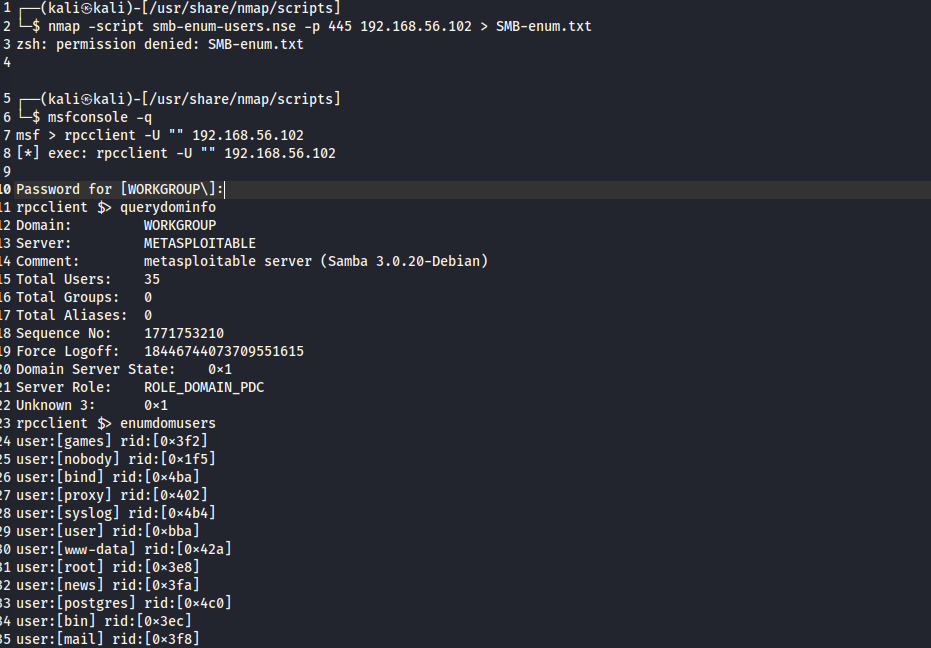

# Module 03: Active Reconnaissance & Vulnerability Assessment

---

## 1. Executive Summary
This assessment presents the active reconnaissance and automated vulnerability scanning phase conducted against the core infrastructure of **[Target Organization]** (an enterprise manufacturing environment). Utilizing industry-standard auditing toolsets including **Nmap** and **Tenable Nessus Professional**, the engagement identified severe exposed attack surfaces, unauthenticated user enumeration pathways, and multiple critical Remote Code Execution (RCE) vulnerabilities across legacy production servers.

---

## 2. Reconnaissance Methodology & Service Inventory
An exhaustive Layer 4 TCP port sweep was executed against target node 192.168.56.102 to discover active daemons, software versions, and underlying operating system fingerprints.

`ash
# Executed Comprehensive Service and OS Discovery Scan
nmap -p- -sV -sC -O -T4 -Pn 192.168.56.102 -oN nmap_comprehensive_audit.txt
`

### Discovered Exposed Attack Surface
| Port / Protocol | State | Service | Software Version | Initial Risk Assessment |
| :--- | :--- | :--- | :--- | :--- |
| **21/tcp** | OPEN | ftp | vsftpd 2.3.4 | **CRITICAL** (Known backdoor vulnerability CVE-2011-2523) |
| **22/tcp** | OPEN | ssh | OpenSSH 4.7p1 Debian 8ubuntu1 | **MEDIUM** (Outdated version; potential user enumeration) |
| **23/tcp** | OPEN | telnet | Linux telnetd | **HIGH** (Cleartext transmission of administrative credentials) |
| **80/tcp** | OPEN | http | Apache httpd 2.2.8 (Ubuntu, PHP/5.2.4) | **HIGH** (Information disclosure; WebDAV methods enabled) |
| **139, 445/tcp** | OPEN | netbios-ssn | Samba 3.0.20-Debian | **CRITICAL** (Arbitrary command execution CVE-2007-2447) |
| **1524/tcp** | OPEN | ingreslock | Root Shell Listener | **CRITICAL** (Residual unauthenticated root backdoor) |
| **2121/tcp** | OPEN | ftp | ProFTPD 1.3.1 | **HIGH** (Outdated daemon version with arbitrary file copy risks) |
| **3306/tcp** | OPEN | mysql | MySQL 5.0.51a-3ubuntu5 | **MEDIUM** (Weak authentication; exposed database listener) |
| **5432/tcp** | OPEN | postgresql | PostgreSQL Database 8.3.0 | **MEDIUM** (Potential brute-force target for credential reuse) |
| **5900/tcp** | OPEN | vnc | VNC (protocol 3.3) | **HIGH** (Legacy VNC lacking robust transport encryption) |
| **6667/tcp** | OPEN | irc | UnrealIRCd | **CRITICAL** (Trojaned backdoor release CVE-2010-2075) |

---

## 3. Automated Vulnerability Scanning (Nessus Professional)
A credential-free vulnerability scan conducted via **Tenable Nessus** revealed an exceptionally high density of exploitable vulnerabilities on the target node.

### High-Priority Vulnerability Matrix
| Vulnerability Identifier | Target Component | CVSS v3.1 | Severity | Vulnerability Summary |
| :--- | :--- | :--- | :--- | :--- |
| **CVE-2007-2447** | Samba 3.0.20 | **9.8** | **CRITICAL** | username map script allows remote unauthenticated root command execution. |
| **CVE-2011-2523** | vsftpd 2.3.4 | **9.8** | **CRITICAL** | Backdoored source archive containing smiley trigger opening shell on port 6200. |
| **CVE-2004-2687** | DistCC Daemon | **9.3** | **CRITICAL** | Distributed compiler daemon executes arbitrary commands without authentication. |
| **CVE-2010-2075** | UnrealIRCd 3.2.8.1 | **7.5** | **HIGH** | Embedded DEBUG backdoor in distribution archive permitting remote execution. |
| **Insecure Protocols** | Telnet & Cleartext FTP | **7.4** | **HIGH** | Unencrypted authentication protocols susceptible to Layer 2 eavesdropping. |

---

## 4. User Account Enumeration via SMB (Port 445)
Utilizing Samba Null Session querying and automated enumeration scripts against port 445, the assessment successfully extracted the complete local user database from the target host without requiring prior credentials:

`
[Enumerated Local Accounts: 35 Total Users]
root, daemon, bin, sys, sync, games, man, lp, mail, news, uucp, proxy, 
majordomo, postgres, service, telnetd, sshd, distccd, user, msfadmin, 
klog, bind, postfix, ftp, mysql, messagebus, nobody, statd, backup, 
syslog, www-data, cupsys, dhcp, proftpd, gnats
`

*Figure 3.3: Terminal artifact confirming unauthenticated enumeration of 35 local user accounts via Samba/rpcclient on Port 445.*

**Security Implication:** The ability for an unauthenticated network observer to enumerate valid usernames directly facilitates targeted offline and online password brute-forcing (such as targeted dictionary attacks against SSH, FTP, or web management interfaces).

---

## 5. Strategic Threat Prioritization & Next-Phase Roadmap
Based on the vulnerability and reconnaissance findings, two primary vectors were prioritized for exploitation validation in the penetration testing phase:
1. **Vector Alpha: Samba username map script (CVE-2007-2447):** Demonstrates highest reliability (Metasploit ranking: Excellent), requiring zero user interaction and yielding immediate root privilege.
2. **Vector Beta: vsftpd 2.3.4 Backdoor (CVE-2011-2523):** Provides secondary verification of total host compromise via compromised third-party software binaries.
