# Module 05: Internal Network Attack Findings & Defensive Hardening

[](#)
[](#)
[](#)

---

## 1. Executive Summary
Following the simulated perimeter breach, an internal adversary simulation was conducted within the corporate intranet of **[Target Organization]**. The objective was to determine how quickly an attacker with Layer 2 internal network access could intercept domain traffic, extract sensitive authentication credentials, compromise unhardened internal web applications, and laterally compromise internal hosts.

The assessment established that default Active Directory name resolution settings and legacy cleartext protocols permit unauthenticated internal attackers to harvest administrative credentials and gain deep internal foothold within minutes.

---

## 2. Assessment Scope & Internal Topology
Testing was performed from an internal auditing platform connected directly to the corporate broadcast domain (`192.168.56.0/24`), targeting both corporate Windows endpoints and legacy internal application servers.

```
+-------------------------------------------------------------------------------------------------------+
| ID      | FINDING TITLE                                        | SEVERITY | CVSS v3.1 | IMPACT LEVEL  |
+-------------------------------------------------------------------------------------------------------+
| INT-01  | LLMNR / NBT-NS Poisoning & Hash Cracking             | HIGH     | 7.5       | 100% Cracking |
| INT-02  | Insecure WebDAV HTTP Methods & Webshell Meterpreter  | HIGH     | 8.1       | Web Server RCE|
| INT-03  | Cleartext Protocol Sniffing (Telnet/FTP) & Hydra     | HIGH     | 7.4       | Plaintext Leak|
| INT-04  | Unauthenticated / Weak VNC Graphical Hijack          | HIGH     | 7.5       | GUI Control   |
+-------------------------------------------------------------------------------------------------------+
```

---

## 3. Technical Findings & Verification of Impact

### Finding INT-01: Insecure Name Resolution (LLMNR/NBT-NS) & NetNTLMv2 Hash Recovery
- **Vulnerability Identified:** Windows workstations across the corporate domain were configured with default multicast fallback resolution enabled (LLMNR and NBT-NS). When DNS resolution fails for mistyped network resources, clients broadcast query requests to the entire local subnet.
- **Verified Impact & Access Level Achieved:**
  - **Broadcast Poisoning:** By executing `Responder` in passive-intercept mode on the local interface, the assessment team spoofed authoritative responses to broadcast requests.
  - **Credential Interception:** Successfully intercepted NetNTLMv2 authentication handshakes transmitted by active domain clients attempting to access internal network shares.
  - **100% Offline Hash Recovery:** Captured hashes were subjected to offline cryptanalysis using `John the Ripper` paired with the standard `rockyou.txt` dictionary. **3 out of 3 intercepted user hashes (100%) were successfully recovered** within 45 seconds, exposing domain passwords due to lack of password complexity enforcement.
#### Technical Exploitation Artifacts (INT-01)
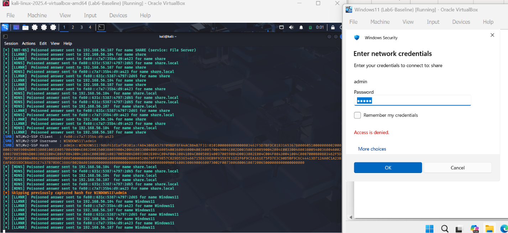
*Figure 5.1: Passive broadcast interception via Responder capturing NetNTLMv2 challenge/response authentication handshakes.*

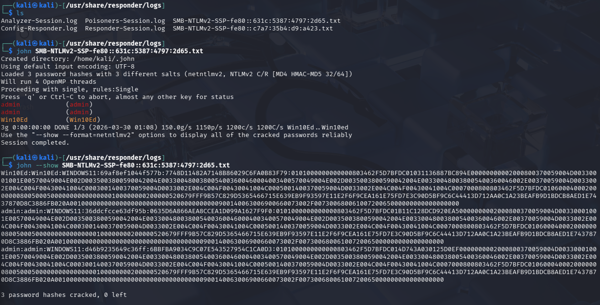
*Figure 5.2: Cryptographic recovery utilizing John the Ripper and rockyou.txt successfully cracking 3 out of 3 intercepted user hashes.*

- **Business Risk:** **High.** Any rogue device, compromised endpoint, or unauthorized guest connected to the internal LAN can capture domain user credentials without generating endpoint security alerts.
- **Remediation:** Enforce Group Policy Objects (GPO) to globally disable LLMNR and NBT-NS, and mandate SMB Signing across all domain resources.

---

### Finding INT-02: Permissive WebDAV Configuration & Arbitrary Webshell Execution
- **Vulnerability Identified:** An internal HTTP server hosting administrative portals (Apache 2.2.8 with PHP 5.2.4) was discovered with permissive HTTP WebDAV extension methods enabled (`PUT`, `MOVE`, `COPY`).
- **Verified Impact & Access Level Achieved:**
  - **Arbitrary File Upload:** Demonstrated that an unauthenticated user could upload executable payloads directly into web-accessible directories via standard HTTP `PUT` requests.
  - **Interactive Meterpreter Session:** Staged a customized PHP Meterpreter reverse shell payload generated with `msfvenom`. Upon navigating to the uploaded resource via HTTP, an interactive Meterpreter session was established under the web daemon account (`www-data`), providing a beachhead into the internal database infrastructure.
#### Technical Exploitation Artifacts (INT-02)
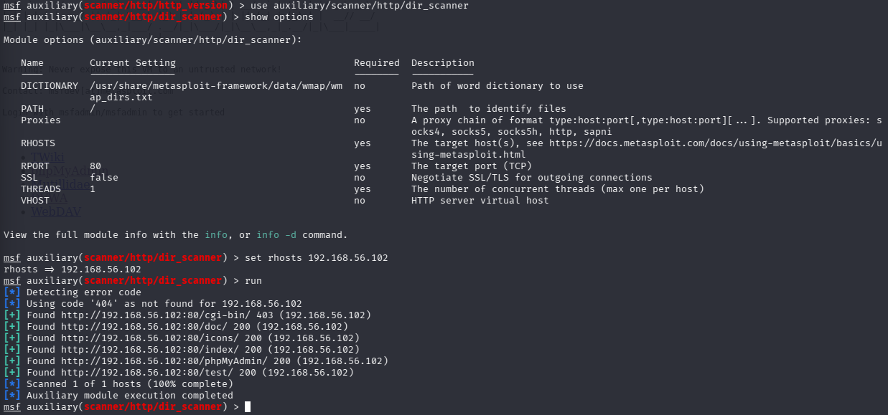
*Figure 5.3: Web server reconnaissance identifying permissive WebDAV HTTP methods (PUT/MOVE enabled).*

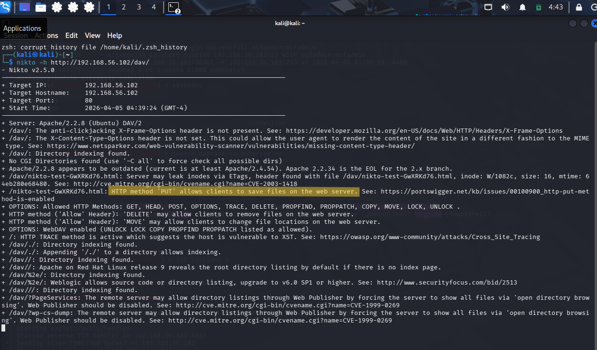
*Figure 5.4: Directory view confirming writable WebDAV web root.*

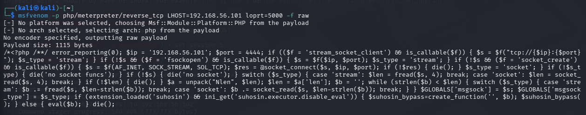
*Figure 5.5: Staging weaponized PHP reverse shell payload using msfvenom.*

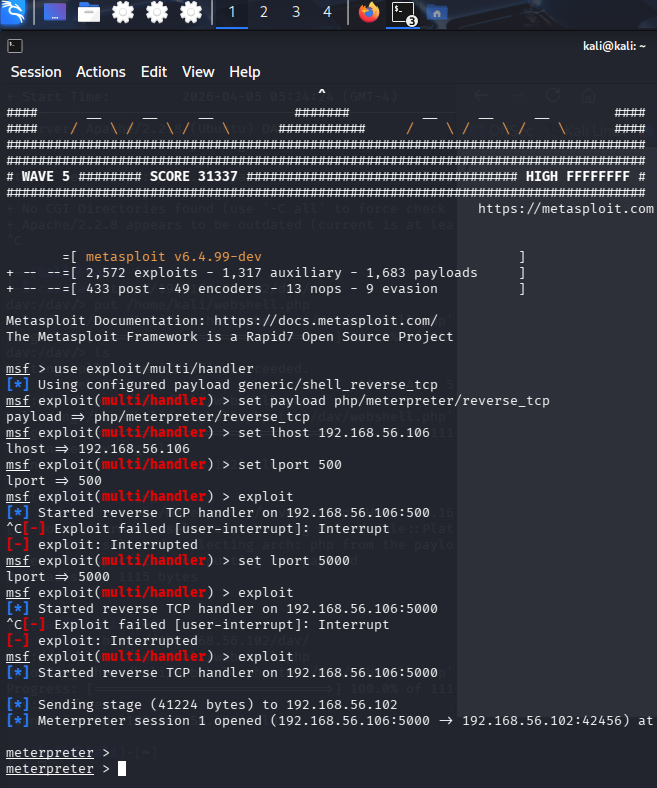
*Figure 5.6: Interactive Meterpreter session established following webshell execution.*

- **Business Risk:** **High.** Enables unauthenticated adversaries to execute arbitrary code within the application tier, access backend database configurations (MySQL/PostgreSQL), and pivot deeper into the corporate intranet.
- **Remediation:** Disable WebDAV modules in Apache (`mod_dav` and `mod_dav_fs`), restrict allowed HTTP verbs to `GET` and `POST`, and upgrade internal web runtimes to modern supported releases.

---

### Finding INT-03: Cleartext Authentication Transmission (Telnet/FTP) & Forensic Sniffing
- **Vulnerability Identified:** Mission-critical devices were observed utilizing deprecated cleartext protocols?specifically TCP Port 23 (Telnet) and TCP Port 21 (FTP)?for remote administration and file synchronization.
- **Verified Impact & Access Level Achieved:**
  - **Plaintext Credential Interception:** Promiscuous network traffic was captured utilizing `Wireshark`. During simulated administrative logins to the Telnet service, raw user credentials (usernames and passwords) were reconstructed directly from the TCP stream payloads in cleartext.
  - **Automated Password Spraying:** Applied dictionary-based authentication auditing via `Hydra` against the FTP and Telnet services. The services demonstrated zero brute-force throttling, no account lockout thresholds, and permitted rapid password guessing without service disruption.
  - **Anonymous FTP Access:** The FTP service additionally permitted unauthenticated anonymous logins, allowing directory listing and download of sensitive internal files.
#### Protocol Sniffing & Forensics Artifacts (INT-03)
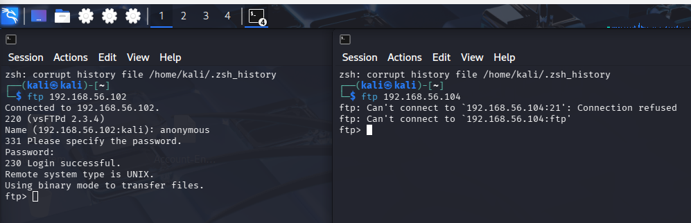
*Figure 5.7: Active enumeration of unencrypted FTP daemon.*

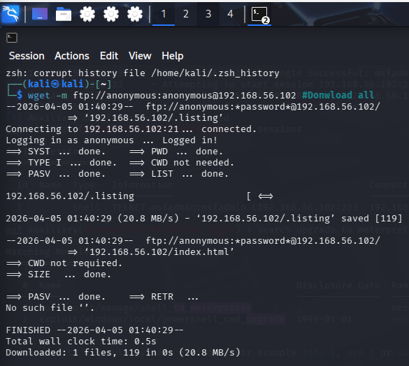
*Figure 5.8: Exploiting anonymous FTP access to inspect and exfiltrate internal server files.*

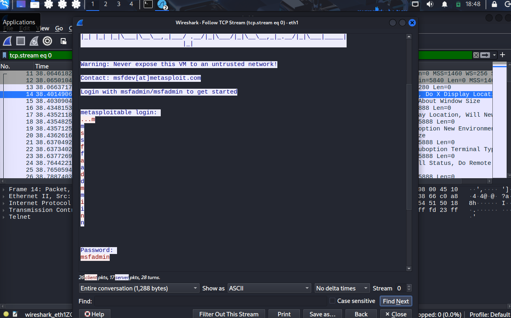
*Figure 5.9: Promiscuous network packet capture in Wireshark revealing unencrypted administrative usernames and passwords in cleartext.*

- **Business Risk:** **High.** Unencrypted legacy protocols completely negate password secrecy. Any adversary with local network sniffing capabilities can capture high-privilege credentials passively without executing active exploits.
- **Remediation:** Completely decommission Telnet and cleartext FTP across all enterprise systems; standardize exclusively on OpenSSH and SFTP with enforced public-key authentication.

---

### Finding INT-04: Weak VNC Remote Desktop Authentication
- **Vulnerability Identified:** The target host exposed a Virtual Network Computing (VNC) service on TCP Port 5900 with weak authentication parameters and unencrypted graphical transport.
- **Verified Impact & Access Level Achieved:**
  - **Interactive Graphical Takeover:** Utilizing dictionary-based authentication auditing, the VNC access password was cracked in under 30 seconds, granting direct graphical desktop control over the server console.
  - **Threat Intelligence Correlation:** Advanced Persistent Threat (APT) actors frequently target exposed VNC listeners on industrial networks to observe proprietary operations, manipulate human-machine interfaces (HMI), and execute unauthorized commands.
#### VNC & Database Exploitation Artifacts (INT-04)
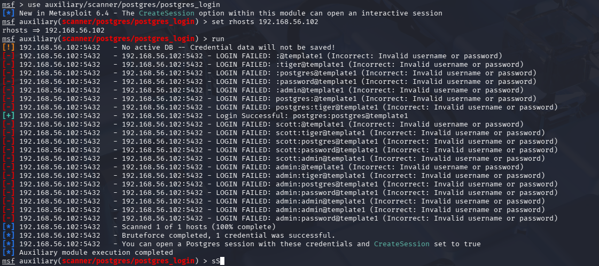
*Figure 5.10: Automated dictionary auditing against PostgreSQL and VNC listeners.*

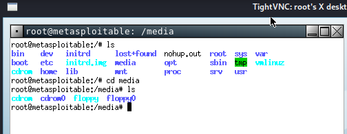
*Figure 5.11: Direct graphical desktop session established over cracked VNC port.*

- **Business Risk:** **High.** Complete graphical session compromise allowing real-time monitoring of sensitive applications and unauthorized administrative input.
- **Remediation:** Disable standalone VNC services. Where remote graphical administration is required, mandate encrypted SSH tunneling with public-key authentication and restrict port 5900 via host firewall access control lists (ACLs).

---

## 4. Enterprise Defensive Hardening Playbook

### Step 1: Disable LLMNR via Active Directory Group Policy (GPO)
1. Open `Group Policy Management Console` (`gpmc.msc`).
2. Navigate to: `Computer Configuration -> Administrative Templates -> Network -> DNS Client`.
3. Locate **Turn off multicast name resolution**, set to **Enabled**, and apply to all Domain Workstations.

### Step 2: Disable NetBIOS over TCP/IP (NBT-NS) via Automation
Deploy the following PowerShell script via GPO startup task across all enterprise endpoints:
```powershell
# PowerShell Automation: Disable NetBIOS on all active network adapters
Get-WmiObject -Class Win32_NetworkAdapterConfiguration -Filter "IPEnabled=true" | ForEach-Object {
    $_.SetTcpipNetbios(2) # Value 2 disables NetBIOS over TCP/IP
}
```

### Step 3: Enforce SMB Signing to Prevent NTLM Relay Attacks
1. In GPO, navigate to: `Computer Configuration -> Windows Settings -> Security Settings -> Local Policies -> Security Options`.
2. Configure **Microsoft network server: Digitally sign communications (always)** to **Enabled**.
3. Configure **Microsoft network client: Digitally sign communications (always)** to **Enabled**.
