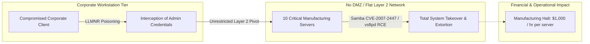

# Module 06: Enterprise VAPT Executive Outbrief & NIST Remediation Roadmap

[](#)
[](#)
[](#)

---

## 1. Engagement Background & Executive Overview
**Assessment Organization:** Pentesters-R-Us Independent Security Practice  
**Client Organization:** **[Target Organization]** (Enterprise Discrete Manufacturing)  
**Target Audience:** Chief Executive Officer (CEO), Chief Operating Officer (COO), Chief Information Security Officer (CISO), and Chief of Manufacturing  
**Engagement Type:** Annual Comprehensive Vulnerability Assessment and Penetration Test (VAPT)  

### 1.1 Executive Summary
During this authorized engagement, the assessment team validated that **[Target Organization]**?s core operational infrastructure is exposed to critical cybersecurity risks. Due to an unsegmented (flat) corporate network topology, unpatched legacy operating systems, and default protocol configurations, an adversary gaining basic access to any corporate workstation can achieve total administrative compromise over mission-critical computer-aided manufacturing (CAM) servers within minutes.

### 1.2 The Business Dilemma & Financial Impact
The manufacturing division operates **10 dedicated Linux servers** and **60 engineering workstations** that generate core corporate revenue. Key operational realities include:
- **Downtime Cost:** Unscheduled downtime on manufacturing servers incurs a direct cost of **$1,000 per hour per server** ($10,000/hour across all production units).
- **Executive Resistance:** Historically, management has been hesitant to disrupt manufacturing cycles for patching under the premise that *"we have never had a security incident, so we must be secure."*
- **The Finding:** The assessment proved that these mission-critical systems contain multiple remotely exploitable vulnerabilities with **CVSS 9.8 Critical** ratings, rendering them vulnerable to automated ransomware campaigns that would trigger catastrophic unscheduled downtime.



---

## 2. Quantitative Scope & Threat Exposure
Multiplying identified vulnerabilities across the physical device footprint reveals the true magnitude of organizational exposure:

| Asset Category | Unit Count | Operating Environment | Critical/High Vulns per Node | Total Exploitable Attack Points |
| :--- | :--- | :--- | :--- | :--- |
| **Manufacturing Production Servers** | 10 | Legacy Linux (Ubuntu 8.04) | 10+ Critical/High | **100+ High-Severity Exploits** |
| **Engineering Workstations** | 60 | Legacy Linux CAM Platform | 10+ Critical/High | **600+ High-Severity Exploits** |
| **Legacy Corporate Servers** | 40 | Windows Server 2003 | Outdated SMB / NetBIOS | Pervasive NTLM Relay Targets |
| **Corporate Client Laptops** | 900 | Windows 11 Enterprise | Default GPO / No EDR | Lateral Movement Beachheads |

**Total Enterprise Port-Based Exposure:** Over **1,750 unmonitored legacy service instances** (FTP, Telnet, Ingreslock, VNC) were active across corporate and manufacturing segments.

---

## 3. Root Cause Architecture Analysis: The Flat Network Risk
The most dangerous vulnerability discovered is architectural rather than software-specific:
1. **Absence of a Demilitarized Zone (DMZ):** External-facing services and internal file shares share identical broadcast domains.
2. **Lack of IT / OT Segmentation:** Corporate laptops (which connect remotely from off-site locations and public Wi-Fi) reside on the same broadcast domain as multi-million dollar manufacturing controllers.
3. **Over-Permissive Service Policies:** Engineering workflows claimed requirements for ports 21, 23, 80, 139, 2121, 5900, and 6667. In reality, technical analysis confirmed only **Port 5900 (VNC)** was required for remote monitoring, and could be protected through secure tunneling.

---

## 4. Prioritized Strategic Remediation Roadmap (NIST CSF Aligned)

To balance immediate threat reduction against production uptime requirements, recommendations are structured into a 3-phase roadmap aligned with the **NIST Cybersecurity Framework (CSF)**:

```
+-----------------------------------------------------------------------------------------------+
| PHASE          | TIMEFRAME    | PRIMARY OBJECTIVE                | OPERATIONAL DOWNTIME       |
+-----------------------------------------------------------------------------------------------+
| Short-Term     | 0 - 30 Days  | Low-Hanging Fruit & Protocol GPO | ZERO Downtime Required     |
| Medium-Term    | 1 - 3 Months | Compensating OT Controls & MFA   | Minimal Scheduled Windows  |
| Long-Term      | 3 - 12 Months| Micro-Segmentation & Migration   | Planned Lifecycle Project  |
+-----------------------------------------------------------------------------------------------+
```

---

### Phase 1: Short-Term Remediation (0 ? 30 Days) ? *Zero Operational Disruption*
- **[PR.AC-1] Enforce Active Directory GPO Hardening:**
  - Globally disable LLMNR and NBT-NS via Group Policy to eliminate internal credential interception.
  - Enforce SMB Signing across all domain communications to prevent NTLM relay attacks.
- **[PR.PT-4] Terminate Deprecated Cleartext Daemons:**
  - Immediately shut down Port 23 (Telnet) and Port 21 (FTP) across all 70 manufacturing hosts. Enforce SSH with public-key authentication.
- **[PR.AC-3] Host-Based Firewall Enforcement:**
  - Enable `ufw` on all manufacturing servers, dropping all inbound traffic by default except authorized administrative SSH and restricted VNC management IPs.

### Phase 2: Medium-Term Remediation (1 ? 3 Months) ? *Compensating Controls for Legacy OT*
- **[DE.CM-1] Implement Compensating Controls on Unpatchable Manufacturing Nodes:**
  - Because legacy manufacturing software cannot be upgraded immediately without vendor recertification, implement host-level defenses:
    - Deploy `auditd` kernel monitoring for unauthorized process execution.
    - Deploy lightweight `ClamAV` scanning and automated rootkit hunters (`rkhunter`).
    - Enforce local credential hardening and air-gap USB ports on manufacturing floors.
- **[PR.AC-7] Multi-Factor Authentication (MFA) Rollout:**
  - Mandate MFA across all remote access vectors, VPN gateways, and administrative RDP jump boxes.
- **[DE.CM-4] Modern Endpoint Detection & Response (EDR):**
  - Transition the 900 corporate Windows 11 endpoints from legacy signature antivirus to an EDR platform with tamper resistance.

### Phase 3: Long-Term Remediation (3 ? 12 Months) ? *Architectural Resilience*
- **[PR.AC-5] Network Micro-Segmentation & Industrial DMZ (IDMZ):**
  - Redesign corporate network topology according to the **Purdue Model for Industrial Control Systems (ICS)**.
  - Separate corporate IT (VLAN 10), Management (VLAN 20), and Manufacturing OT (VLAN 100) using Layer 7 Next-Generation Firewalls (NGFW) with deep packet inspection.
- **[PR.MA-1] Modernization & Legacy Platform Migration Roadmap:**
  - Formulate a 12-month capital modernization budget to migrate legacy Ubuntu 8.04 servers and Windows Server 2003 systems to supported, enterprise long-term support (LTS) distributions.
- **[GV.OC-1] Formal Adoption of NIST Cybersecurity Framework:**
  - Establish a formal Vulnerability Management Lifecycle with continuous automated scanning, SLA-driven patching, and annual independent penetration tests.
